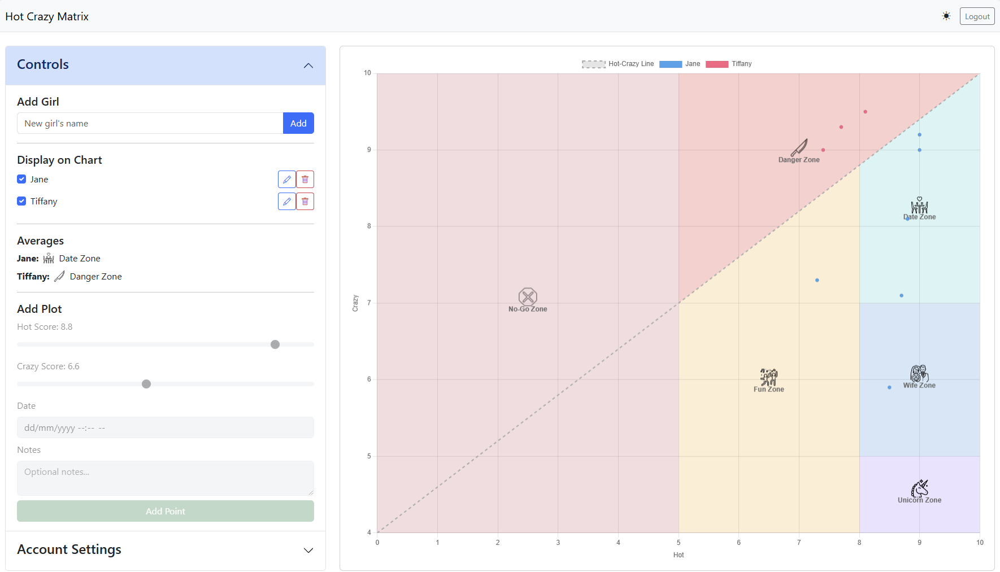

[](https://opensource.org/licenses/MIT)
[](https://github.com/Vinman75)

Tired of anecdotal evidence and flawed methodologies in your dating life? It's time to bring scientific rigor to the chaos. This web application is a sophisticated tool for plotting, tracking, and analyzing data points on the legendary Hot-Crazy Matrix.

Because you can't argue with a chart.

### The Foundational Research

This entire project is based on the groundbreaking scientific theory presented by Professor B. Stinson.

[](https://www.youtube.com/watch?v=pInk1rV2VEg)

## ✨ Live Research Facility

A fully operational, live version of this tool is available for your immediate use.

**[https://hot-crazy-matrix.duckdns.org/](https://hot-crazy-matrix.duckdns.org/)**

#### How to Secure Your Research Account

Your highly sensitive data is for your eyes only.
1.  Proceed to the secure registration portal: **[https://hot-crazy-matrix.duckdns.org/auth/register](https://hot-crazy-matrix.duckdns.org/auth/register)**
2.  Choose a memorable alias (username) and a secure passcode (password, min. 8 characters).
3.  Click "Register".
4.  Log in and commence your research.

## 📈 The Interface

The application features a clean and responsive interface, optimized for both detailed analysis at your main lab station (desktop) and quick data entry in the field (mobile).



### Responsive Design for Lab & Field Work

The user interface is built with a "liquid" or responsive layout that automatically adapts to the screen size of your device.

*   **On Desktop**: The control panel and the chart are displayed side-by-side. This wide format takes advantage of the available screen space, allowing you to see your data and controls simultaneously without scrolling.
*   **On Mobile**: The layout stacks vertically. The control panel collapses into an accordion at the top, and the chart is given a taller aspect ratio (`min-height: 60vh`). This ensures that the chart remains large, clear, and easy to interact with on a narrow phone screen.

## 🔬 The Science (Features)

*   **Top-Secret User Accounts**: Your research is yours alone. All data is securely partitioned under your private account.
*   **Interactive Specimen Analysis**: Plot data points directly on the chart with a simple click. No Ph.D. required.
*   **Longitudinal Studies**: Add, track, edit, and (if necessary) delete "Girls" and their associated data points over time.
*   **The Vickie Mendoza Diagonal**: The infamous dividing line is clearly marked, ensuring you never stray into the No-Go Zone unprepared.
*   **Advanced Zone Calculation**: The system automatically calculates the average position of each subject, clearly identifying their location in the Fun Zone, Wife Zone, Danger Zone, or even the mythical Unicorn Zone.
*   **Day & Night Research Modes**: Toggle between light and dark themes for comfortable data analysis, no matter the hour.
*   **Global Timezone Synchronization**: Conduct your research from anywhere in the world. Set your personal timezone in the account settings to ensure all your data points and timestamps are displayed accurately in your local time.
*   **Dockerized & Portable Lab**: The entire application is containerized, so you can set up your own private research lab anywhere.

## 🧪 The Lab (Tech Stack)

*   **Backend**: Flask, Gunicorn, pytz
*   **Database**: SQLAlchemy, SQLite, Flask-Migrate
*   **Frontend**: Bootstrap 5, Chart.js, JavaScript
*   **Deployment**: Docker & Docker Compose

## 🐳 Deploying Your Own Research Lab

Want to host your own private instance? Easy. You just need **Docker** and **Docker Compose** installed.

#### Step 1: Acquire the Lab Schematics (Clone Repo)

Get the code on your local machine or server.

```bash
git clone [YOUR_REPOSITORY_URL]
cd [YOUR_PROJECT_DIRECTORY]
```